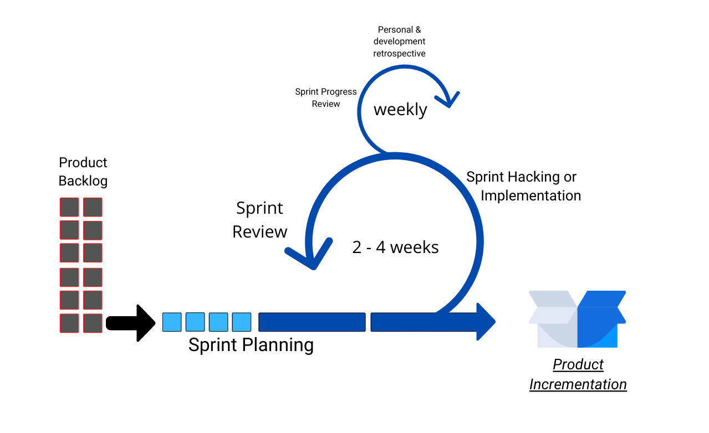
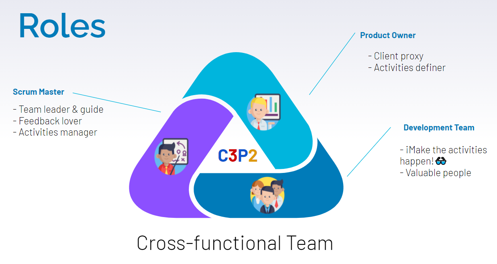

# Proceso de Desarrollo

Nuestro proceso es una adaptación de tres métodos de gestión de proyectos diferentes; Scrum, Kanban y el método incremental. El proceso está divido en 6 pasos (5 de ellos son interativos). El primer paso es la recolección de requerimientos de usuario, a este paso le llamamos "Product Backlog", después se inicia con la fase del "Sprint Planning" donde se seleccionan los requerimientos priorizados respecto a su importancia para el cliente y su complejidad, así como el tiempo que nos tomará para desarrollarlo en el siguiente paso; el llamado "Sprint Hacking or implemetation" que corresponde al desarrollo de las actividades que corresponden al cumplimiento de los requerimientos seleccionados anteriormente.
La fase o paso de "Sprint Progress Review" y la fase "Personal & Development Retrospective" se repiten semanalmente durante el tiempo del Sprint; se revisan avances y se realiza una retroalimentación con comentarios, dudas, opiniones y sugerencias sobre el desempeño en la contribución individual y los obstáculos personales que aparecen a lo largo de la semana. La última fase del sprint pero no del proceso es el "Sprint Review", en este paso se revisan los resultados de las actividades realizadas durante el sprint y se concluye, para dar inicio a un nuevo sprint.

## ¿Qué es un "Product Incrementation"?
Un incremento de producto es la suma de los resultados obtenidos durante el sprint junto con todos los resultados de sprints previos, estos resultados deben coincidir con el estado de "HECHO" y deberán asemejarse a la definición de "TERMINADO" para todo el equipo de desarrollo.

## Roles para lograr lo propuesto

Para llevar a cabo el proceso antes menciona es importante definir cierto roles que en conjunto formarán un equipo **multifuncional**.

- **Product Owner:** Se encarga de hacer un vínculo con el cliente y definir requerimientos adecuadamente que satisfagan las necesidades del cliente. [Esteban Cimé](https://github.com/estecimo)
- **Scrum Master:** Monitorea los avances, genera feedback para el equipo, aumenta lo productividad del mismo y revisa el progreso continuo del proyecto. [Tony Cituk](https://github.com/Antonio-Cituk)
- **Development Team:** La élite que se encarga de hacer realidad el producto de software en desarrollo:
  - [Esteban Cimé](https://github.com/estecimo)
  - [Tony Cituk](https://github.com/Antonio-Cituk)
  - [Saúl Palma](https://github.com/saulpalma26)
  - [Erik Poot](https://github.com/erikpsanchez)

## Plan del proyecto

### Resúmen
El plan del proyecto inicia desde la [investigacion](./investigacion.md) del posible producto hasta la 1era versión del mismo. Está dividida en 2 categorías "Planeación" y "Desarrollo" que cuentan con un total de 4 sprints con sus respectivas actividades.

### Calendario de actividades

- [ ] Planeación (24/10/2020-28/11/2020)
- Durante estos días se llevará a cabo la planeación del producto, desde como empezaremos la elaboración hasta la implementación de nuevas ideas ofrecidas por el equipo para así poder así poder tener un sistema organizado y eficiente.

- [ ] Desarrollo (21/11/2020-13/01/2021)
- Durante todo este periodo de tiempo se llevará a cabo la elaboración del proyecto hasta poder llegar a su conclusión y obtener un producto final.

- [ ] Sprint Piloto (24/10/2020-31/10/2020)
- El equipo seleccionará el medio por el cual se comunicarán, también se hará la elección del nombre del equipo, del producto, se determinarán los roles y los días y horario para los futuros meetings, a su vez que se realizarán investigaciones sobre conocimientos previos en relación al producto.

- [ ] Sprint 01 (31/10/2020-14/11/2020)
- Se realizarán diversas investigaciones sobre como llevar a cabo el desarrollo del bot como de la web usando maquetas así como también sobre temas relacionados para la creación de un logo y se creará el repositorio de Github para llevar a cabo la documentación del producto.

- [ ] Sprint 02 (14/11/2020-12/12/2020)
- Se llevarán a cabo diferentes versiones de la repo-card y el diseño del logo, así como también se realizará un mockup de la web,también se llevará a cabo la forma en la que el bot se presentará (un saludo) y se generará una imagen sobre como funcionará la arquitectura del producto.

- [ ] Sprint 03 (12/12/2020-09/01/2021)
- Se deberá de agregar y organizar la información que haya sido ingresada, la cual deberá de estar en forma de texto, a la vez que se le será proporcionada la información que haya sido consultada por el usuario, también, a través de un formulario, se le deberá permitir visualizar y agregar información.

- [ ] Beta1 (16/01/2021)
- Se realizará la implementación a teams, se llevará a cabo el servicio de hosting con firebase y se almacenará con heroku, a su vez que se realizarán sus respectivas pruebas.

- [ ] Sprint 04 (09/01/2021-23/01/2021)
- Se le permitirá al usuario editar y eliminar la información previamente introducida, también se le proporcionará un punto de acceso web de la libreta en linea, al momento de ser solicitada. Dentro de la WebApp estará una sección de FAQ's (preguntas frecuentes) las cuales servirán para poder brindarle soporte al usuario.

- [ ] Review and NextSteps (30/01/2021-01/02/2021)
- Se hablará entre el equipo para la revisión del producto a su vez que se proporcionarán ideas para una implementación futura.

- [ ] Release (27/01/2021)
- Se realizaran los primeros 3 puntos redactados en la Beta1 y se dará a cabo el lanzamiento oficial de la primera version del bot.

### Changelog

- [ ] Sprint 02 
- Se realizó un cambio en la fecha de finalización de este Sprint (Debiendo de finalizar el 28/11/2020 y este siendo cambiado a 12/12/2020)debido a el surgimiemto de un problema de tiempo de disponibilidad para el proyecto.

- [ ] Sprint 03
- La modificación de la fecha final de este Sprint (12/12/2020 siendo cambiada al 09/01/2021) Se vio causada al aplazamiento del sprint anterior

- [ ] Beta1
-  Se le dio un cambio a la fecha de lanzamiento de la primera beta de Hunnigan debido a que la fecha anterior (18/12/2020) resultaba conflictiba para la finalización de actividades del equipo de trabajo.

- [ ] Sprint 04 
- La fecha de finalización de este sprint fue aplazada debido a un choque con las fechas de los sprints anteriores.

- [ ] Release 
- Como producto de los cambios realizados en las fechas de los sprints y beta anteriores, la fecha de lanzamiento de Hunnigan se tuvo que ver aplazada.

