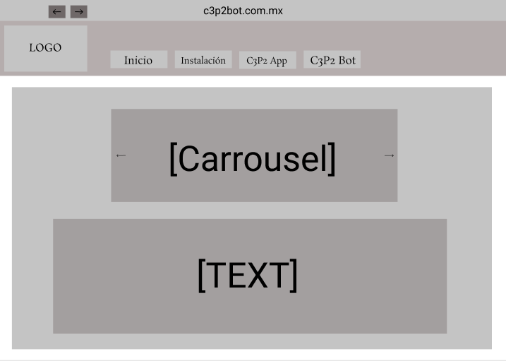
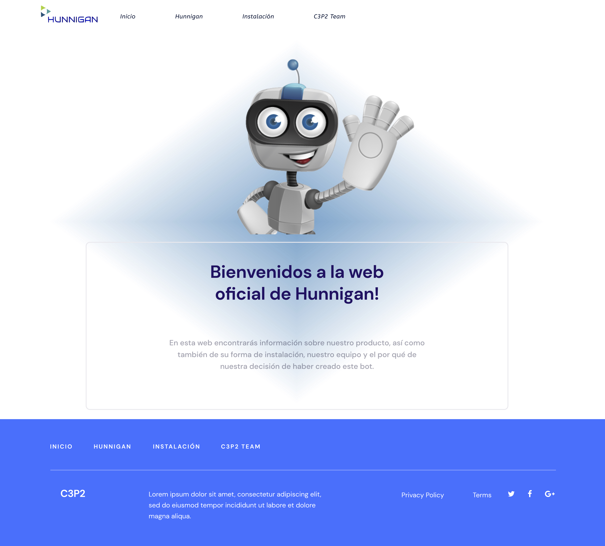
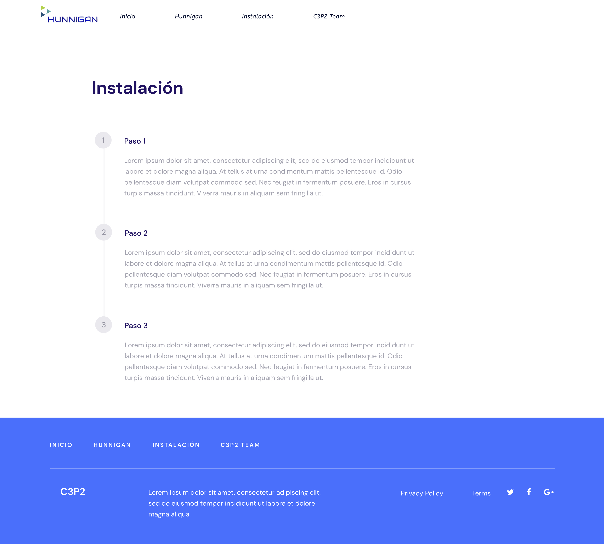
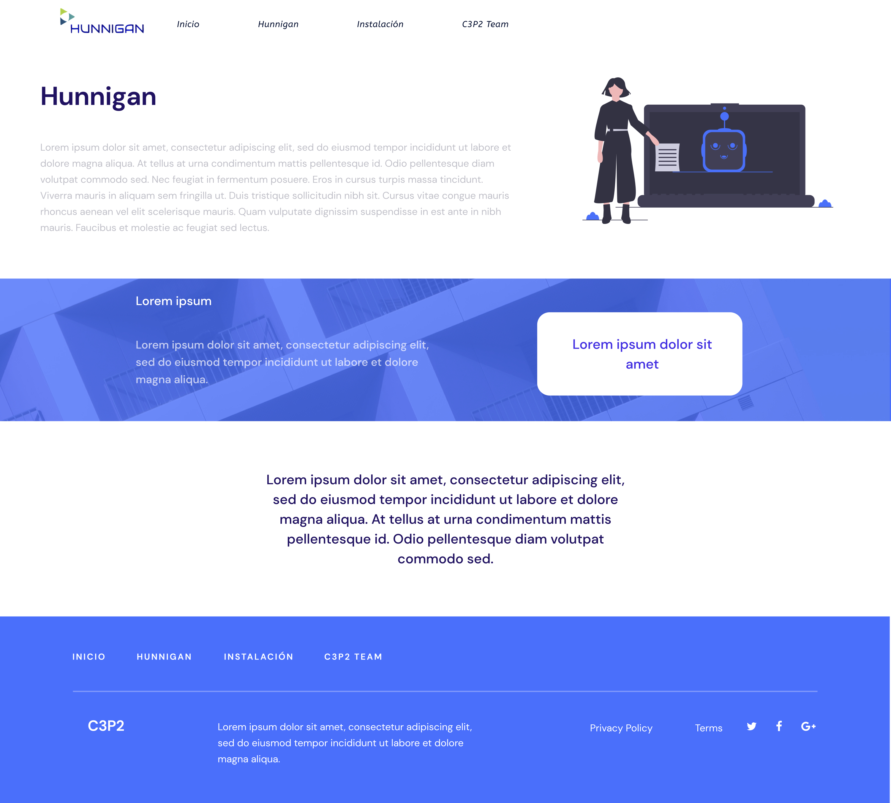
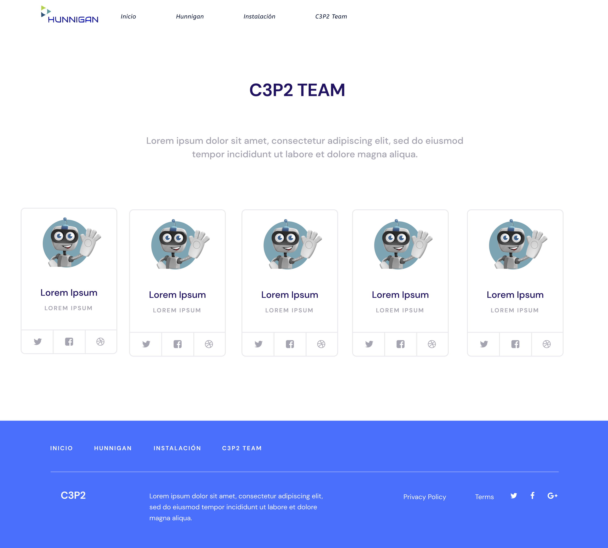

# Diseño
## Wireframe

## ¿Cómo se compone nuestro Wireframe?

- [ ] Imagen del logo
- Al ser nuestro producto y el tema de la página, se proyecta nuestro logo oficial de Hunnigan.

- [ ] Navbar
- Contiene una barra navegación para el fácil acceso de las demás páginas de nuestra web.

- [ ] Carrusel
- Contiene un carrusel de imagenes en el cual se verían proyectadas imagenes sobre Hunnigan y relacionados

- [ ] Texto 
- El wireframe contiene texto el cual en la web oficial será referente a nuestro proyecto y dando una bienvenida a el.

### Prototipo Visual

## Inicio

- Al igual que en el wireframe anterior, se le da una bienvenida o introducción a los usuarios a la web, para que el consumidor pueda familiarizarse con nuestro producto.

## Instalación

- Se le dará una serie de intrucciones numeradas al usuario para la correcta y completa instalación del bot 

## Huniggan

- En este apartado de la página se dara una breve descripción al usuario sobre Hunnigan así como su historia y el por qué de su creación.

## C3P2 Team

- En este apartado de la página, el usuario podra visualizar las redes de nuestro equipo de trabajo así como también nuestro origen y nuestra historia como equipo.
